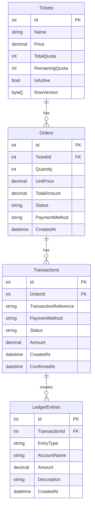

# 🎟️ E-Ticketing & Payment Simulation Platform

## 📌 Overview

This project is a backend-focused e-ticketing system built with ASP.NET Core and EF Core using Code-First migrations.

It simulates a real-world ticket booking and payment system, including:

* Ticket selection
* Checkout process
* Payment simulation (Credit Card & QR)
* Double-entry ledger system
* Concurrency handling

---

## 🛠 Tech Stack

* ASP.NET Core 8
* Entity Framework Core (Code-First)
* SQL Server
* React (Frontend)
* Docker
* xUnit (Unit Testing)

---

## 🚀 Features

* View available ticket types (Gold, Premium, VIP)
* Book tickets with quantity validation
* Payment methods:

  * Credit Card (instant success)
  * QR (simulated delay ~8 seconds)
* Double-entry accounting ledger
* Database transaction safety
* Concurrency handling using RowVersion
* Dockerized environment

---

## 🗄 Database Design (ERD)



---

## 🔄 Checkout Flow

1. User selects ticket
2. API validates quota
3. Order is created
4. Transaction is created
5. Payment is processed:

   * Credit Card → instant success
   * QR → delayed success (8 seconds)
6. On success:

   * Ticket quota is reduced
   * Order marked as Paid
   * Ledger entries created (Debit & Credit)
7. Entire process wrapped in DB transaction

---

## 💰 Ledger System

Each successful transaction creates two entries:

* Debit → Cash / Payment Gateway
* Credit → Ticket Sales Revenue

This ensures financial accuracy using double-entry accounting.

---

## ⚠️ Crash Safety

All operations are wrapped in a database transaction.

If the API crashes mid-process:

* No partial data is saved
* Ledger remains consistent

---

## 🧪 Running Locally

1. Clone repository
2. Update connection string in `appsettings.json`
3. Run:

```bash
dotnet ef database update
dotnet run
```

---

## 🐳 Running with Docker

```bash
docker-compose up --build
```

---

## 📡 API Endpoints

* GET `/api/tickets`
* POST `/api/checkout`

---

## 🧪 Testing

```bash
dotnet test
```

---

## 💡 Notes

* QR payment is simulated using async delay
* No real payment gateway integration
* Focus is on backend logic, data integrity, and architecture

---
